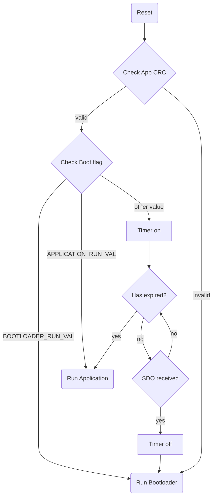

# CANopenNode_C2000_bootloader
This is a CANopen bootloader for C2000 microcontroller using CANopenNode.

| Tool                     | Version         | Note                    |
|--------------------------|-----------------|-------------------------|
| Code Composer Studio     | v10.2.0         |                         |
| TI Compiler              | v22.6.0.LTS     |                         |
| Object Dictionary Editor | v4.1.2-gff637a7 | Link: [CANopenEditor](https://github.com/CANopenNode/CANopenEditor) |

