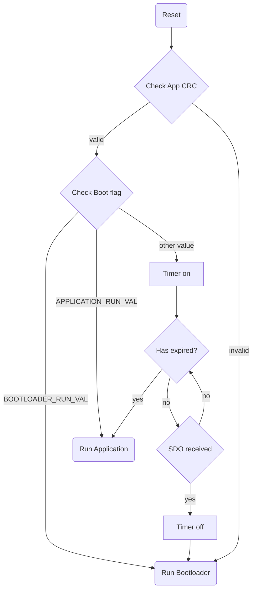

# CANopenNode_C2000_bootloader
This is a CANopen bootloader for C2000 microcontroller using CANopenNode.

| Tool                     | Version         | Note                    |
|--------------------------|-----------------|-------------------------|
| Code Composer Studio     | v10.2.0         |                         |
| TI Compiler              | v22.6.0.LTS     |                         |
| Object Dictionary Editor | v4.1.2-gff637a7 | Link: [CANopenEditor](https://github.com/CANopenNode/CANopenEditor) |

## Feature
- Does not use interrupts
- Entirely polled communication
- Executed after device reset or power-up.  Execution is independent on loaded application.
- Minimal hardware initialization.
- Flash programming and verification.
- Overwrite protection of bootloader code area (Flash Sector A).
- Application code verification using CRC.  List of supported algorithms is found in Section 8.9 of TMS320C28xx Assembly Language Tool document. Example of supported CRC algorithms:
    - CRC32_PRIME
    - CRC16_802_15_4
- Backdoor access with waiting window (default is 500ms)
- LSS slave supported.
- LSS slave node Id and bitrate is stored into EEPROM, if available.

## Execution Flow
